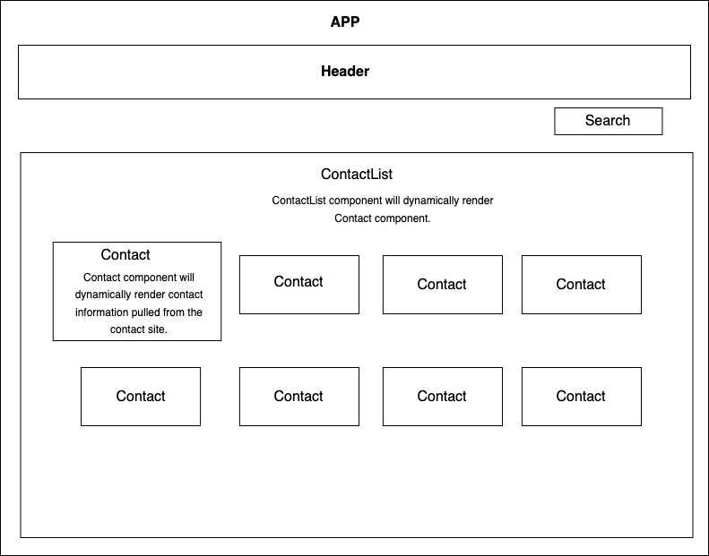

# Address Book Take Home Challenge

## By Hayley McVay
 

### This application dynamically pulls a list of random contacts and displays them styled to look like virutal business cards. 

 

## App Diagram

 

 

## Technologies Used

* React
* Javascript
* HTML
* CSS

 

## Description

This is a take home challenge for WalkerTracker to demonstrate fundamentals in React, custom CSS styling, and my own coding style.
 

## Setup/Installation Requirements

* You will need to have [NPM](https://nodejs.org/en/) installed on your machine.
* Ensure you have react installed; if not you can run `npm i react`

* Clone this repository to your local computer.
* Navigate to the project's root directory, `address-book`, and run `npm install` in your terminal to install the necessary dependencies. 
* Next, run `npm run build` to ensure there are no compiling errors, and then run `npm start` to open the live server (http://localhost:3000) in your browser to view the webpage.

 

## Known Bugs

* None so far

 
